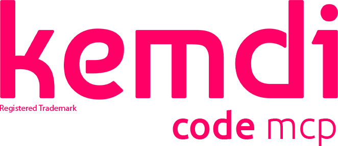

<p align="center">
  
</p>

<h3 align="center">Model Context Protocol Server for AI-Powered Development</h3>

<p align="center">
  103 tools &bull; 7 LLM providers &bull; multi-agent orchestration &bull; kanban &bull; project memory
</p>

<p align="center">
  <a href="https://www.npmjs.com/package/kemdicode-mcp"></a>
  <a href="https://github.com/kemdi-pl/kemdicode-mcp/releases"></a>
  <a href="LICENSE"></a>
</p>

<p align="center">
  <a href="https://bun.sh"></a>
  <a href="https://nodejs.org"></a>
  <a href="https://www.typescriptlang.org"></a>
  <a href="https://redis.io"></a>
</p>

---

**kemdiCode MCP** is a [Model Context Protocol](https://modelcontextprotocol.io/) server that gives AI agents and IDE assistants access to **100+ specialized tools** for code analysis, generation, git operations, file management, AST-aware editing, project memory, multi-board kanban, and multi-agent coordination.

<details>
<summary><strong>Table of Contents</strong></summary>

- [What's New in 1.17.0](#whats-new-in-1170)
- [Usage Examples](#usage-examples)
- [Highlights](#highlights)
- [Compatibility](#compatibility)
- [Quick Start](#quick-start)
- [IDE Configuration](#ide-configuration)
- [Multi-Provider LLM](#multi-provider-llm)
- [Tool Reference](#tool-reference)
- [Architecture](#architecture)
- [Multi-Agent Orchestration](#multi-agent-orchestration)
- [Multi-Model Consensus](#multi-model-consensus)
- [Kanban Task Management](#kanban-task-management)
- [Recursive Tool Invocation](#recursive-tool-invocation)
- [CLI Reference](#cli-reference)
- [Development](#development)
- [Authors](#authors)
- [License](#license)

</details>

---

## What's New in 1.17.0

- **Checkpoint Save/Restore** &mdash; new tools `checkpoint-save` and `checkpoint-restore` for temporary state snapshots in Redis (7-day TTL). Save progress mid-task and restore later.
- **Session Resume** &mdash; new `/resume` HTTP endpoint returns the last active session with tool history, enabling post-compaction recovery. SSE connections receive a `resume` event on reconnect.
- **Runtime Tool Broadcast** &mdash; dynamically registered tools now trigger `notifications/tools/list_changed` to all connected MCP clients, so IDEs see new tools without reconnecting.
- **Session CWD Injection** &mdash; file tools automatically inherit the session's working directory for correct relative path resolution in multi-session setups.
- **Session Cleanup** &mdash; proper cleanup of activity tracking and server references on session close, preventing memory leaks in long-running servers.
- **Compact Tool Descriptions** &mdash; reduced tool description sizes across all 103 tools to slow down context compaction in long sessions.

---

## Usage Examples

### Using kemdiCode MCP tools from your AI agent prompt

You don't call these tools directly &mdash; your AI agent (Claude Code, Cursor, etc.) invokes them when you describe what you need. Here are real prompts and what happens behind the scenes:

**Code review before committing:**
```
You: "Review the auth module for security issues"
→ Agent calls: code-review --files "@src/auth/**/*.ts" --focus "security"
```

**Fix a bug with AI assistance:**
```
You: "There's a race condition in the queue processor, find and fix it"
→ Agent calls: fix-bug --description "race condition in queue processor" --files "@src/queue/"
```

**Save progress and restore later:**
```
You: "Save a checkpoint of the current refactoring state"
→ Agent calls: checkpoint-save --name "auth-refactor-v2" --content "<state>" --tags '["refactor","auth"]'

You: "Restore the auth refactoring checkpoint"
→ Agent calls: checkpoint-restore --name "auth-refactor-v2"
```

**Multi-model comparison for architecture decisions:**
```
You: "Ask 3 models whether we should use event sourcing or CRUD for the order service"
→ Agent calls: consensus-prompt \
    --prompt "Event sourcing vs CRUD for an order management service with 10k orders/day" \
    --boardModels '["o:gpt-5","a:claude-sonnet-4-5","g:gemini-3-pro"]' \
    --ceoModel "a:claude-opus-4-5:4k"
```

**Project memory for persistent context:**
```
You: "Remember that we use JWT with RS256 for auth in this project"
→ Agent calls: write-memory --name "auth-strategy" --content "JWT with RS256, keys in /etc/keys/" --tags '["auth","architecture"]'

You: "What was our auth strategy?"
→ Agent calls: read-memory --name "auth-strategy"
```

**Multi-agent task distribution:**
```
You: "Set up 3 agents: backend, frontend, QA. Backend works on the API, frontend on React components"
→ Agent calls: agent-register → task-create → task-push-multi
→ Agents coordinate via shared-thoughts and queue-message
```

---

## Highlights

| Capability | Description |
|:-----------|:------------|
| **103 MCP Tools** | Code review, refactoring, testing, git, file management, AST editing, memory, checkpoints, kanban |
| **7 LLM Providers** | Native SDKs for OpenAI (GPT-5), Anthropic (Claude 4.5), Gemini (Gemini 3) + OpenAI-compatible for Groq, DeepSeek, Ollama, OpenRouter |
| **Multi-Agent** | Agents connect via HTTP, share context through Redis Pub/Sub, coordinate via kanban boards |
| **Parallel Multi-Model** | Send one prompt to N models simultaneously; CEO-and-Board consensus pattern |
| **Thinking Tokens** | Unified syntax across providers: `o:gpt-5:high` &bull; `a:claude-sonnet-4-5:4k` &bull; `g:gemini-3-pro:8k` |
| **Tree-sitter AST** | Language-aware navigation and symbol editing for 19 languages |
| **Project Memory** | Persistent per-project key-value store with TTL and tags |
| **Hot Reload** | Change provider, model, or config at runtime without restart |
| **Cross-Runtime** | Runs on Bun (recommended) or Node.js with automatic detection |

---

## Compatibility

| IDE / Editor | Status | Config location |
|:-------------|:------:|:----------------|
| **Claude Code** | ✅ | `claude mcp add` or `~/.claude.json` |
| **Cursor** | ✅ | Settings &rarr; Features &rarr; MCP |
| **KiroCode** | ✅ | `~/.kirocode/mcp.json` |
| **RooCode** | ✅ | VS Code extension settings |

---

## Quick Start

### Prerequisites

- **Bun** &ge; 1.0 _(recommended)_ or **Node.js** &ge; 18
- **Redis** _(optional &mdash; required only for multi-agent features)_

### Install & Run

```bash
git clone https://github.com/kemdi-pl/kemdicode-mcp.git
cd kemdicode-mcp
bun install && bun run build:bun
bun run start:bun
```

<details>
<summary>Node.js alternative</summary>

```bash
npm install && npm run build && npm run start
```

</details>

---

## IDE Configuration

<details open>
<summary><strong>Claude Code</strong></summary>

```bash
claude mcp add kemdicode-mcp -- bun /path/to/kemdicode-mcp/dist/index.js
```

Or add to `~/.claude.json`:

```json
{
  "mcpServers": {
    "kemdicode-mcp": {
      "command": "bun",
      "args": ["/path/to/kemdicode-mcp/dist/index.js"]
    }
  }
}
```

</details>

<details>
<summary><strong>Cursor</strong></summary>

Settings &rarr; Features &rarr; MCP:

```json
{
  "mcpServers": {
    "kemdicode-mcp": {
      "command": "bun",
      "args": ["/path/to/kemdicode-mcp/dist/index.js", "-m", "gpt-5"]
    }
  }
}
```

</details>

<details>
<summary><strong>KiroCode</strong></summary>

Add to `~/.kirocode/mcp.json`:

```json
{
  "mcpServers": {
    "kemdicode-mcp": {
      "command": "bun",
      "args": [
        "/path/to/kemdicode-mcp/dist/index.js",
        "-m", "claude-sonnet-4-5",
        "--redis-host", "127.0.0.1"
      ]
    }
  }
}
```

</details>

<details>
<summary><strong>RooCode</strong></summary>

Add to VS Code settings (RooCode extension):

```json
{
  "mcpServers": {
    "kemdicode-mcp": {
      "command": "bun",
      "args": [
        "/path/to/kemdicode-mcp/dist/index.js",
        "-m", "claude-sonnet-4-5",
        "--redis-host", "127.0.0.1"
      ]
    }
  }
}
```

</details>

---

## Multi-Provider LLM

kemdiCode MCP ships with **7 built-in providers**. Each can be activated by setting the corresponding API key:

```bash
export OPENAI_API_KEY=sk-...            # OpenAI
export ANTHROPIC_API_KEY=sk-ant-...     # Anthropic
export GEMINI_API_KEY=AI...             # Google Gemini
export GROQ_API_KEY=gsk_...            # Groq
export DEEPSEEK_API_KEY=sk-...          # DeepSeek
export OPENROUTER_API_KEY=sk-or-...     # OpenRouter
# Ollama — no key required (local)
```

### Provider Syntax

Use `provider:model` (or the short alias) anywhere a model is accepted:

```
openai:gpt-5               o:gpt-5              # Latest flagship model
openai:gpt-5.1-codex       o:gpt-5.1-codex      # Best for coding
openai:o3                  o:o3                 # Reasoning model
anthropic:claude-sonnet-4-5-20250929  a:claude-sonnet-4-5  # Best balance
anthropic:claude-opus-4-5-20251101    a:claude-opus-4-5    # Maximum intelligence
gemini:gemini-3-pro-preview           g:gemini-3-pro       # Most intelligent
gemini:gemini-3-flash-preview         g:gemini-3-flash     # Best price/performance
gemini:gemini-2.5-flash    g:gemini-2.5-flash   # Fast with thinking
groq:llama-3.3-70b         q:llama-3.3-70b      # Fast inference
deepseek:deepseek-chat     d:deepseek-chat      # Cost effective
ollama:llama3.3            l:llama3.3           # Local deployment
openrouter:gpt-5           r:gpt-5              # Aggregator access
```

### Thinking / Reasoning Tokens

Append a third segment to enable extended thinking:

| Provider | Syntax | Effect |
|:---------|:-------|:-------|
| OpenAI (reasoning) | `o:gpt-5:high` | Sets `reasoning_effort` to low / medium / high |
| Anthropic | `a:claude-sonnet-4-5:4k` | Allocates 4 096 extended thinking tokens |
| Gemini | `g:gemini-3-pro:8k` | Allocates 8 192 thinking tokens |
| OpenAI Codex | `o:gpt-5.1-codex:high` | Maximum compute for coding tasks |

### Recommended Models (2025)

| Use Case | Recommended Model | Syntax | Why |
|:---------|:------------------|:-------|:----|
| **General coding** | Claude Sonnet 4.5 | `a:claude-sonnet-4-5` | Best balance of intelligence, speed, and cost |
| **Complex architecture** | Claude Opus 4.5 | `a:claude-opus-4-5:4k` | Maximum intelligence for complex reasoning |
| **Fast iterations** | GPT-5 | `o:gpt-5` | Fastest flagship model for rapid development |
| **Agentic coding** | GPT-5.1 Codex | `o:gpt-5.1-codex` | Optimized for long-horizon coding tasks |
| **Reasoning tasks** | GPT-5 (high) | `o:gpt-5:high` | Extended thinking for complex problems |
| **Multimodal** | Gemini 3 Pro | `g:gemini-3-pro` | Best for image/video understanding |
| **Cost-effective** | Gemini 3 Flash | `g:gemini-3-flash` | Best price-performance ratio |
| **Local/offline** | Llama 3.3 (Ollama) | `l:llama3.3` | Private, no API costs |
| **High throughput** | Groq Llama 3.3 | `q:llama-3.3-70b` | Fastest inference speeds |

### Runtime Configuration

```bash
# Discover models from a provider
ai-models --action list

# Switch model at runtime
ai-models --action select --model gpt-5

# Use specific model with thinking tokens
ai-models --action select --model claude-opus-4-5:4k

# Set custom API endpoint (e.g. NVIDIA NIM)
ai-config --action set --apiBaseUrl https://integrate.api.nvidia.com/v1

# Verify connection
ai-config --action test
```

---

## Tool Reference

> **103 tools** across 20 categories.

| Category | # | Tools |
|:---------|:-:|:------|
| **AI Agents** | 4 | `plan` `build` `brainstorm` `ask-ai` |
| **Multi-LLM** | 2 | `multi-prompt` `consensus-prompt` |
| **Code Analysis** | 8 | `code-review` `explain-code` `find-definition` `find-references` `find-symbols` `semantic-search` `code-outline` `analyze-deps` |
| **Line Editing** | 4 | `insert-at-line` `delete-lines` `replace-lines` `replace-content` |
| **Symbol Editing** | 3 | `insert-before-symbol` `insert-after-symbol` `rename-symbol` |
| **Code Modification** | 5 | `fix-bug` `refactor` `auto-fix` `auto-fix-agent` `write-tests` |
| **Project Memory** | 7 | `write-memory` `read-memory` `list-memories` `edit-memory` `delete-memory` `checkpoint-save` `checkpoint-restore` |
| **Git** | 5 | `git-status` `git-diff` `git-log` `git-blame` `git-branch` |
| **File Operations** | 5 | `file-read` `file-write` `file-search` `file-tree` `file-diff` |
| **Project** | 5 | `project-info` `run-script` `run-tests` `run-lint` `check-types` |
| **Kanban &mdash; Tasks** | 7 | `task-create` `task-list` `task-update` `task-claim` `task-assign` `task-push-multi` `board-status` |
| **Kanban &mdash; Workspaces** | 4 | `workspace-create` `workspace-list` `workspace-join` `workspace-leave` |
| **Kanban &mdash; Boards** | 5 | `board-create` `board-list` `board-share` `board-members` `board-invite` |
| **Recursive** | 3 | `invoke-tool` `invoke-batch` `invocation-log` |
| **Multi-Agent** | 13 | `agent-list` `agent-register` `agent-watch` `agent-alert` `agent-inject` `agent-history` `monitor` `agent-summary` `queue-message` `shared-thoughts` `get-shared-context` `feedback` `batch` |
| **Session** | 5 | `session-list` `session-info` `session-create` `session-switch` `session-delete` |
| **MPC Security** | 4 | `mpc-split` `mpc-distribute` `mpc-reconstruct` `mpc-status` |
| **RL Learning** | 2 | `rl-reward-stats` `rl-dopamine-log` |
| **Knowledge Graph** | 4 | `graph-query` `graph-find-path` `loci-recall` `sequence-recommend` |
| **System** | 10 | `shell-exec` `process-list` `env-info` `memory-usage` `ai-config` `ai-models` `config` `ping` `help` `timeout-test` |

---

## Architecture

### System Overview

| Layer | Component | Description |
|:------|:----------|:------------|
| **Clients** | Claude Code, Cursor, KiroCode, RooCode | Connect via SSE + JSON-RPC (MCP Protocol) |
| **HTTP Server** | `:3100` (Bun or Node.js) | Routes: `/sse`, `/message`, `/resume`, `/stream` |
| **Session Manager** | Per-client isolation | CWD injection, activity tracking, `/resume` for post-compaction recovery, SSE keep-alive |
| **Tool Registry** | 103 tools, 20 categories | Zod schema validation, auto JSON Schema generation, runtime registration with `tools/list_changed` broadcast |
| **Provider Registry** | 7 LLM providers | OpenAI, Anthropic, Gemini (native SDKs) + Groq, DeepSeek, Ollama, OpenRouter (OpenAI-compatible). Lazy init, hot-reload, unified thinking tokens |
| **Tree-sitter AST** | 19 languages | WASM parsers, symbol navigation, rename, insert before/after, indentation detection |
| **Runtime Abstraction** | Bun / Node.js | Auto-detection at startup. Unified HTTP (`Bun.serve` / `node:http`), process spawning (`Bun.spawn` / `child_process`) |
| **Redis (DB 2)** | Shared state | `mcp:context:*` (tool outputs), `mcp:agents:*` (registry), `mcp:kanban:*` (tasks/boards/workspaces), `mcp:memory:*` (project memory), `mcp:checkpoint:*` (snapshots) |
| **Redis Pub/Sub** | Real-time messaging | Channels: `broadcast`, `inject:<agentId>`, `alerts`, `thoughts` |

### Request Lifecycle

| Step | Client (IDE) | kemdiCode MCP Server | External (Redis / LLM) |
|:----:|:-------------|:---------------------|:-----------------------|
| 1 | `GET /sse` &rarr; | Create session, assign CWD | |
| 2 | | &larr; SSE: `endpoint` + `resume` event | |
| 3 | `POST /message` `{ tool: "code-review" }` &rarr; | | |
| 4 | | Validate args (Zod schema) | |
| 5 | | Execute tool &rarr; | Share result to Redis, record activity |
| 6 | | &larr; SSE: tool result | |
| 7 | `POST /message` `{ tool: "ask-ai" }` &rarr; | | |
| 8 | | Route to LLM provider &rarr; | Provider returns completion |
| 9 | | &larr; SSE: AI response | |

### Source Tree

| Directory | File | Purpose |
|:----------|:-----|:--------|
| `src/` | `index.ts` | Entry point, CLI argument parsing, server bootstrap |
| | `constants.ts` | Error messages, timeouts, limits |
| `src/server/` | `http-server.ts` | HTTP routes: `/sse`, `/message`, `/resume`, `/stream` |
| | `session-server.ts` | MCP Server per session, CWD injection, activity tracking |
| | `types.ts` | `ServerConfig`, `VERSION` constants |
| `src/ai/` | `client.ts` | Completion router (multi-provider + automatic fallback) |
| | `execute.ts` | High-level AI execution with agent system prompts |
| | `agents.ts` | Agent configurations: `plan`, `build`, `explore` |
| | `model-spec.ts` | Parser for `provider:model:thinking` syntax |
| | `file-context.ts` | File attachment &rarr; prompt injection |
| `src/ai/providers/` | `types.ts` | `LLMProvider` interface, `ProviderId`, `ThinkingConfig` |
| | `registry.ts` | Provider registry with lazy initialization |
| | `openai.provider.ts` | OpenAI native SDK (`reasoning_effort`) |
| | `anthropic.provider.ts` | Anthropic native SDK (`thinking` budget) |
| | `gemini.provider.ts` | Google GenAI native SDK (`thinking` budget) |
| | `openai-compat.provider.ts` | Groq, DeepSeek, Ollama, OpenRouter via OpenAI SDK |
| `src/runtime/` | `index.ts` | `isBun` / `isNode` runtime detection |
| | `http.ts` | Unified HTTP: `Bun.serve` &harr; `node:http` |
| | `process.ts` | Unified spawn: `Bun.spawn` &harr; `child_process` |
| | `crypto.ts` | Crypto utilities |
| `src/context/` | `agent-monitor.ts` | Redis Pub/Sub for agent lifecycle and messaging |
| | `storage.ts` | Redis-based shared context store (DB 2) |
| | `feedback-loop.ts` | Learning from iteration results |
| | `iteration-tracker.ts` | Track fix attempts per issue |
| `src/kanban/` | `kanban-store.ts` | Task CRUD with Redis `hset`/`hgetall` persistence |
| | `workspace-store.ts` | Workspace CRUD operations |
| | `board-store.ts` | Board management and membership |
| | `membership-store.ts` | Role-based access: owner / admin / member / viewer |
| | `migration.ts` | Lazy migration to multi-board schema |
| `src/recursive/` | `tool-invoker.ts` | Safe recursive tool calls: max depth 2, rate-limited, parallel isolation |
| `src/tree-sitter/` | `parser-manager.ts` | WASM parser lifecycle for 19 languages |
| | `types.ts` | Language &harr; extension mappings, symbol types |
| `src/session/` | `manager.ts` | Session create / destroy / cleanup lifecycle |
| | `cwd-resolver.ts` | Project path resolution priority chain |
| `src/tools/` | `registry.ts` | `UnifiedTool` interface, Zod &rarr; JSON Schema, broadcast on register |
| | `index.ts` | Central tool registration (103 tools) |
| `src/tools/agents/` | 9 tools | `agent-register`, `agent-watch`, `agent-alert`, `agent-inject`, `monitor`, `agent-summary`, `queue-message`, `agent-list`, `agent-history` |
| `src/tools/code/` | 8 tools | `find-definition`, `find-references`, `find-symbols`, `code-outline`, `insert-before-symbol`, `insert-after-symbol`, `rename-symbol`, `semantic-search` |
| `src/tools/context/` | 4 tools | `shared-thoughts`, `get-shared-context`, `feedback`, `batch` |
| `src/tools/edit/` | 4 tools | `insert-at-line`, `delete-lines`, `replace-lines`, `replace-content` |
| `src/tools/file/` | 5 tools | `file-read`, `file-write`, `file-search`, `file-tree`, `file-diff` |
| `src/tools/git/` | 5 tools | `git-status`, `git-diff`, `git-log`, `git-blame`, `git-branch` |
| `src/tools/kanban/` | 16 tools | Tasks (7), boards (5), workspaces (4) |
| `src/tools/memory/` | 7 tools | `write-memory`, `read-memory`, `list-memories`, `edit-memory`, `delete-memory`, `checkpoint-save`, `checkpoint-restore` |
| `src/tools/multi-llm/` | 2 tools | `multi-prompt`, `consensus-prompt` |
| `src/tools/project/` | 5 tools | `project-info`, `run-script`, `run-tests`, `run-lint`, `check-types` |
| `src/tools/recursive/` | 3 tools | `invoke-tool`, `invoke-batch`, `invocation-log` |
| `src/tools/specialized/` | 8 tools | `code-review`, `explain-code`, `analyze-deps`, `fix-bug`, `refactor`, `auto-fix`, `auto-fix-agent`, `write-tests` |
| `src/tools/session/` | 5 tools | `session-list`, `session-info`, `session-create`, `session-switch`, `session-delete` |
| `src/tools/system/` | 10 tools | `shell-exec`, `process-list`, `env-info`, `memory-usage`, `ai-config`, `ai-models`, `config`, `ping`, `help`, `timeout-test` |
| `src/tools/loci/` | 4 tools | `graph-query`, `graph-find-path`, `loci-recall`, `sequence-recommend` |
| `src/tools/mpc/` | 4 tools | `mpc-split`, `mpc-distribute`, `mpc-reconstruct`, `mpc-status` |
| `src/tools/rl/` | 2 tools | `rl-reward-stats`, `rl-dopamine-log` |
| `src/utils/` | `commandExecutor.ts` | Process spawning with timeout, SIGTERM &rarr; SIGKILL |
| | `file-utils.ts` | Read/write with encoding detection (UTF-8, UTF-16, Latin1) |
| | `edit-utils.ts` | Line-based editing helpers |
| | `git-utils.ts` | Git command builders |
| | `cache.ts` | In-memory TTL cache |
| | `validation.ts` | Rate limiting, path validation, input sanitization |
| | `errors.ts` | Typed error classes (`ValidationError`, `TimeoutError`, etc.) |
| | `logger.ts` | Structured logging with levels |

---

## Multi-Agent Orchestration

Register agents, distribute work across kanban boards, and coordinate via Redis Pub/Sub:

```bash
# Register specialized agents
agent-register --agents '[
  {"id":"backend","role":"backend","capabilities":["typescript","postgresql"]},
  {"id":"frontend","role":"frontend","capabilities":["react","tailwind"]},
  {"id":"qa","role":"quality","capabilities":["jest","cypress"]}
]'

# Distribute tasks
task-push-multi --taskIds '["api-1","api-2"]' --agents '["backend"]' --mode assign

# Broadcast a requirement
queue-message --broadcast true --message "Use OpenAPI 3.0 spec" --priority high

# Real-time monitoring
monitor --view hierarchy
```

**Capabilities:**
- Batch registration (1-20 agents per call)
- Priority message queues (critical / high / normal / low)
- Context injection into running agents
- Hierarchical monitoring: Session &rarr; Workspace &rarr; Board &rarr; Task &rarr; Agent
- Shared knowledge base (`shared-thoughts`)

---

## Multi-Model Consensus

Send one prompt to N models in parallel, then let a CEO model synthesize:

```bash
# Compare responses
multi-prompt --prompt "Explain monads in simple terms" \
  --models '["o:gpt-5", "a:claude-sonnet-4-5", "g:gemini-3-pro"]'

# Compare reasoning capabilities
multi-prompt --prompt "Design a distributed caching strategy" \
  --models '["o:gpt-5:high", "a:claude-opus-4-5:4k", "g:gemini-3-pro:8k"]'

# CEO-and-Board consensus
consensus-prompt \
  --prompt "Redis vs PostgreSQL for sessions?" \
  --boardModels '["o:gpt-5", "a:claude-sonnet-4-5", "g:gemini-3-pro"]' \
  --ceoModel "a:claude-opus-4-5:4k"

# Coding task with specialized models
consensus-prompt \
  --prompt "Refactor this microservice architecture" \
  --boardModels '["o:gpt-5.1-codex", "a:claude-sonnet-4-5", "o:gpt-5:high"]' \
  --ceoModel "a:claude-opus-4-5:4k"
```

All board models run via `Promise.allSettled()` &mdash; individual failures never block the others.

---

## Kanban Task Management

```bash
# Create a workspace
workspace-create --name "Project Alpha"

# Add boards
board-create --name "Backend Sprint 1" --workspaceId <ws-id>
board-create --name "Frontend Bugs"    --workspaceId <ws-id>

# Batch-create tasks
task-create --tasks '[
  {"title":"Auth API","priority":"high","boardId":"<id>"},
  {"title":"Rate limiter","priority":"medium","boardId":"<id>"}
]'

# Push to agents
task-push-multi --taskIds '["t-1","t-2"]' --agents '["agent-1"]' --mode assign
```

**Features:** workspaces &bull; multiple boards &bull; owner / admin / member / viewer roles &bull; batch create / update (1-20 per call) &bull; assign / clone / notify distribution modes

---

## Recursive Tool Invocation

Sub-agents can invoke other tools with built-in safety limits (max depth 2, rate-limited):

```bash
invoke-tool --tool "code-review" --args '{"files":"@src/auth.ts"}'

invoke-batch --invocations '[
  {"tool":"file-read","args":{"path":"@src/index.ts"}},
  {"tool":"run-tests","args":{}}
]' --mode parallel
```

---

## CLI Reference

```bash
bun dist/index.js [options]
```

| Flag | Default | Description |
|:-----|:-------:|:------------|
| `-m, --model` | &mdash; | Primary AI model |
| `-f, --fallback-model` | &mdash; | Fallback on quota / error |
| `--port` | `3100` | HTTP server port |
| `--host` | `127.0.0.1` | Bind address |
| `--redis-host` | `127.0.0.1` | Redis host |
| `--redis-port` | `6379` | Redis port |
| `--no-context` | &mdash; | Disable Redis context sharing |

---

## Development

### Prerequisites

| Requirement | Version | Notes |
|:------------|:--------|:------|
| **Bun** | &ge; 1.0 | Recommended runtime (faster builds, native TS) |
| **Node.js** | &ge; 18 | Alternative runtime (requires `npm run build` first) |
| **Redis** | &ge; 6.0 | Optional &mdash; needed for multi-agent, kanban, memory, context sharing |
| **TypeScript** | 5.0+ | Strict mode enabled, bundled as dev dependency |

### Build & Run

| Command | Description |
|:--------|:------------|
| `bun install` | Install all dependencies |
| `bun run build:bun` | Bundle for Bun runtime (`dist/`) |
| `bun run start:bun` | Start server on `:3100` |
| `bun run dev:bun` | Watch mode with hot-reload |
| `npm run build` | TypeScript compilation (`tsc`) for Node.js |
| `npm run start` | Start with Node.js |

### Quality & Testing

| Command | Description |
|:--------|:------------|
| `bun run typecheck` | Type-check without emitting (`tsc --noEmit`) |
| `bun run lint` | ESLint with TypeScript rules |
| `bun run format` | Prettier formatting |
| `bun run prepare` | Run all checks (typecheck + lint + format) &mdash; use before committing |
| `bun run add-license` | Add GPL-3.0 headers to all source files |
| `bun test` | Run test suite (Vitest) |

### Environment Variables

| Variable | Default | Description |
|:---------|:--------|:------------|
| `OPENAI_API_KEY` | &mdash; | OpenAI API key (GPT-5, o3, Codex) |
| `ANTHROPIC_API_KEY` | &mdash; | Anthropic API key (Claude 4.5) |
| `GEMINI_API_KEY` | &mdash; | Google Gemini API key |
| `GROQ_API_KEY` | &mdash; | Groq API key |
| `DEEPSEEK_API_KEY` | &mdash; | DeepSeek API key |
| `OPENROUTER_API_KEY` | &mdash; | OpenRouter API key |
| `KEMDICODE_SHELL_EXEC_ENABLED` | `false` | Enable `shell-exec` tool (security opt-in) |
| `MPC_MASTER_SECRET` | &mdash; | Master secret for MPC security tools |

### Server Management

```bash
# Start (auto-checks if already running)
./start-server.sh

# Manual start with custom options
nohup bun dist/index.js --port 3100 -m claude-sonnet-4-5 >> /tmp/kemdicode-mcp.log 2>&1 &

# Check status
nc -z 127.0.0.1 3100 && echo "Running"

# View logs
tail -f /tmp/kemdicode-mcp.log

# Restart after code changes
npm run build && pkill -f "bun dist/index.js" && ./start-server.sh
```

### Adding a New Tool

1. Create a file in the appropriate `src/tools/<category>/` subdirectory.
2. Define a Zod schema &mdash; every field **must** have `.describe()` (used for MCP JSON Schema).
3. Implement the `UnifiedTool` interface.
4. Register the tool in `src/tools/index.ts`.
5. Build and connected clients receive `notifications/tools/list_changed` automatically.

```typescript
import { z } from 'zod';
import type { UnifiedTool } from '../registry.js';

const schema = z.object({
  input: z.string().describe('Input value'),
  format: z.enum(['json', 'text']).default('json').describe('Output format'),
});

export const myTool: UnifiedTool<typeof schema> = {
  name: 'my-tool',
  description: 'Short description for MCP tool listing',
  zodSchema: schema,
  // skipContextShare: true,  // Set to true if output is too large for Redis
  execute: async (args, onProgress) => {
    const { input, format } = args;

    // Optional: stream progress to the client
    onProgress?.('Processing...\n');

    // Return JSON string
    return JSON.stringify({ result: input, format });
  },
};
```

### Project Structure Conventions

| Convention | Details |
|:-----------|:--------|
| **Language** | TypeScript strict mode, ES modules (`.js` extensions in imports) |
| **Schemas** | Zod with `.describe()` on every field &rarr; auto-generates JSON Schema for MCP |
| **Error handling** | Typed errors from `utils/errors.ts` (`ValidationError`, `TimeoutError`, `CommandError`) |
| **File paths** | `@path/file.ts` notation in tool arguments (resolved by session CWD) |
| **Prompts** | Always English (for model consistency) |
| **Code style** | Prettier (2-space indent, single quotes, trailing commas) + ESLint |
| **Commit messages** | English, conventional style (`feat:`, `fix:`, `docs:`, `chore:`) |

---

## Authors

**Dawid Irzyk** &mdash; [dawid@kemdi.pl](mailto:dawid@kemdi.pl)
[Kemdi Sp. z o.o.](https://kemdi.pl)

## License

This project is licensed under the **GNU General Public License v3.0** &mdash; see the [LICENSE](LICENSE) file for details.

<p>
  <a href="LICENSE"></a>
</p>
